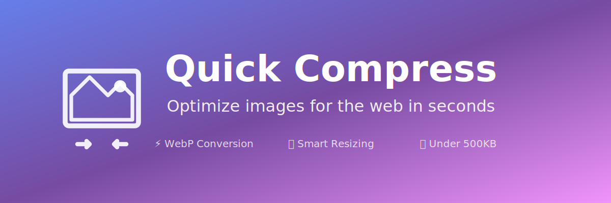

# Quick Compress

<p align="center">
  
</p>

<p align="center">
  <strong>Optimize images for the web in seconds</strong>
</p>

<p align="center">
  <a href="https://github.com/jack/quick-compress/actions"></a>
  <a href="https://github.com/jack/quick-compress/blob/main/LICENSE"></a>
  <a href="https://github.com/jack/quick-compress/releases"></a>
</p>

<p align="center">
  <a href="#features">Features</a> •
  <a href="#installation">Installation</a> •
  <a href="#usage">Usage</a> •
  <a href="#finder-integration">Finder Integration</a> •
  <a href="#configuration">Configuration</a>
</p>

<p align="center">
  
</p>

---

## Features

✨ **WebP Conversion** - Automatically converts images to WebP format for optimal web performance  
📐 **Smart Resizing** - Limits maximum dimensions to 1920x1080 while maintaining aspect ratio  
🎯 **Size Optimization** - Keeps files under 500KB with intelligent quality adjustment  
🖼️ **Quality Preservation** - Maintains visual quality using binary search for optimal compression  
🚀 **Batch Processing** - Process entire folders with a single command  
🍎 **macOS Native** - Finder Quick Actions and Droplet app included  
⚡ **Fast & Simple** - One command, no configuration needed

---

## Installation

### Option 1: Homebrew (Recommended)

```bash
brew tap jack/quick-compress
brew install quick-compress
```

### Option 2: Curl Install Script

```bash
curl -fsSL https://raw.githubusercontent.com/jack/quick-compress/main/install.sh | bash
```

### Option 3: Manual Installation

```bash
# Clone the repository
git clone https://github.com/jack/quick-compress.git

# Run the install script
cd quick-compress
./install.sh
```

### Prerequisites

- macOS or Linux
- [ImageMagick](https://imagemagick.org/) (installed automatically by the install script)

---

## Usage

### Compress a Single File

```bash
compress path/to/image.jpg
```

**Output:** Creates `path/to/image.webp` (235KB from 2.5MB original)

### Compress an Entire Folder

```bash
compress path/to/folder
```

**Output:** Converts all images in the folder to optimized WebP files

### Supported Formats

- JPG / JPEG
- PNG
- GIF
- BMP
- TIFF

All formats are converted to **WebP** for maximum compression and web compatibility.

---

## Finder Integration

### Quick Actions Menu

1. Right-click any image or folder in Finder
2. Go to **Services** → **Compress Images for Web**
3. Get instant optimization!

### Drag & Drop App

1. Find **"Compress Images"** app in your Applications folder
2. Drag any image or folder onto the app icon
3. Or double-click to use the file picker

### Finder Toolbar Button

1. Open Finder
2. Hold **⌘ Command** and drag **"Compress Images"** app to the toolbar
3. Select files and click the button anytime!

---

## Configuration

### Default Settings

| Setting         | Value  | Description                     |
| --------------- | ------ | ------------------------------- |
| Max Width       | 1920px | Maximum image width             |
| Max Height      | 1080px | Maximum image height            |
| Max File Size   | 500KB  | Target file size limit          |
| Initial Quality | 85%    | Starting WebP quality           |
| Min Quality     | 60%    | Lowest quality before giving up |

### Custom Configuration

Edit the script to customize settings:

```bash
# Open the script for editing
nano $(which compress)
```

Modify these variables at the top:

```bash
MAX_WIDTH=2560      # Change max width
MAX_HEIGHT=1440     # Change max height
MAX_SIZE=1048576    # Change to 1MB (in bytes)
QUALITY=90          # Change initial quality
```

---

## How It Works

1. **Analyze** - Checks image dimensions and current file size
2. **Resize** - Scales down images exceeding max dimensions
3. **Convert** - Converts to WebP at 85% quality
4. **Optimize** - If file > 500KB, uses binary search to find best quality under limit
5. **Save** - Outputs optimized WebP in the same location

---

## Examples

### Before & After

| Original    | Compressed  | Savings |
| ----------- | ----------- | ------- |
| 2.5 MB PNG  | 235 KB WebP | 90.6%   |
| 4.1 MB JPG  | 487 KB WebP | 88.1%   |
| 8.7 MB TIFF | 512 KB WebP | 94.1%   |

### Real-World Usage

```bash
# Optimize website assets
compress ~/MyWebsite/images/

# Prepare photos for blog
compress ~/Desktop/vacation-photos/

# Optimize logo
compress ~/Downloads/logo.png
```

---

## Troubleshooting

### "command not found: compress"

Make sure your shell configuration was reloaded:

```bash
source ~/.zshrc  # or ~/.bashrc
```

Or use the full path:

```bash
~/.local/bin/compress image.jpg
```

### ImageMagick Not Found

Install ImageMagick:

```bash
# macOS
brew install imagemagick

# Ubuntu/Debian
sudo apt-get install imagemagick

# Fedora
sudo dnf install imagemagick
```

### Permission Denied

Make sure the script is executable:

```bash
chmod +x ~/.local/bin/compress
```

---

## Contributing

Contributions are welcome! Please feel free to submit a Pull Request.

1. Fork the repository
2. Create your feature branch (`git checkout -b feature/AmazingFeature`)
3. Commit your changes (`git commit -m 'Add some AmazingFeature'`)
4. Push to the branch (`git push origin feature/AmazingFeature`)
5. Open a Pull Request

---

## License

Distributed under the MIT License. See `LICENSE` for more information.

---

## Acknowledgments

- [ImageMagick](https://imagemagick.org/) for the powerful image processing
- Inspired by the need for simple, fast web optimization

---

<p align="center">
  Made with ❤️ for the web development community
</p>
